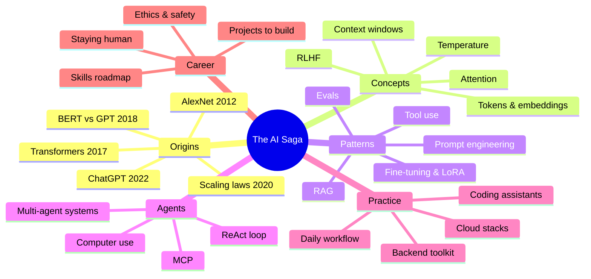
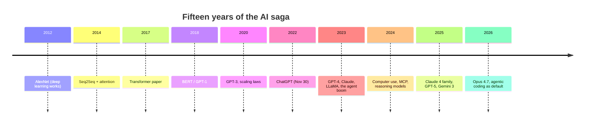
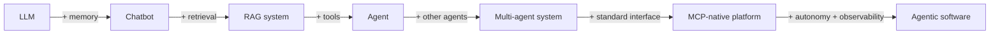
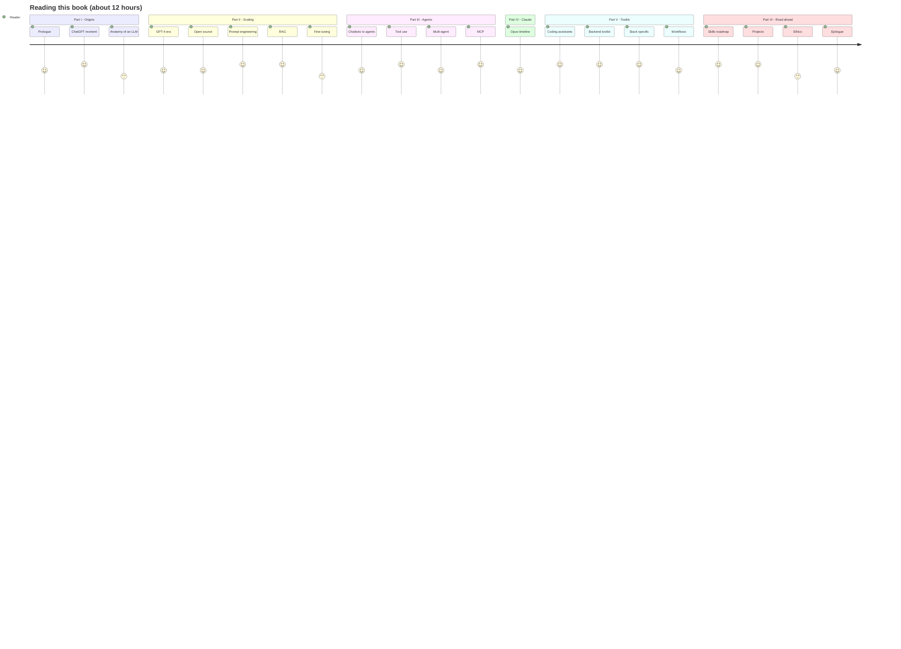
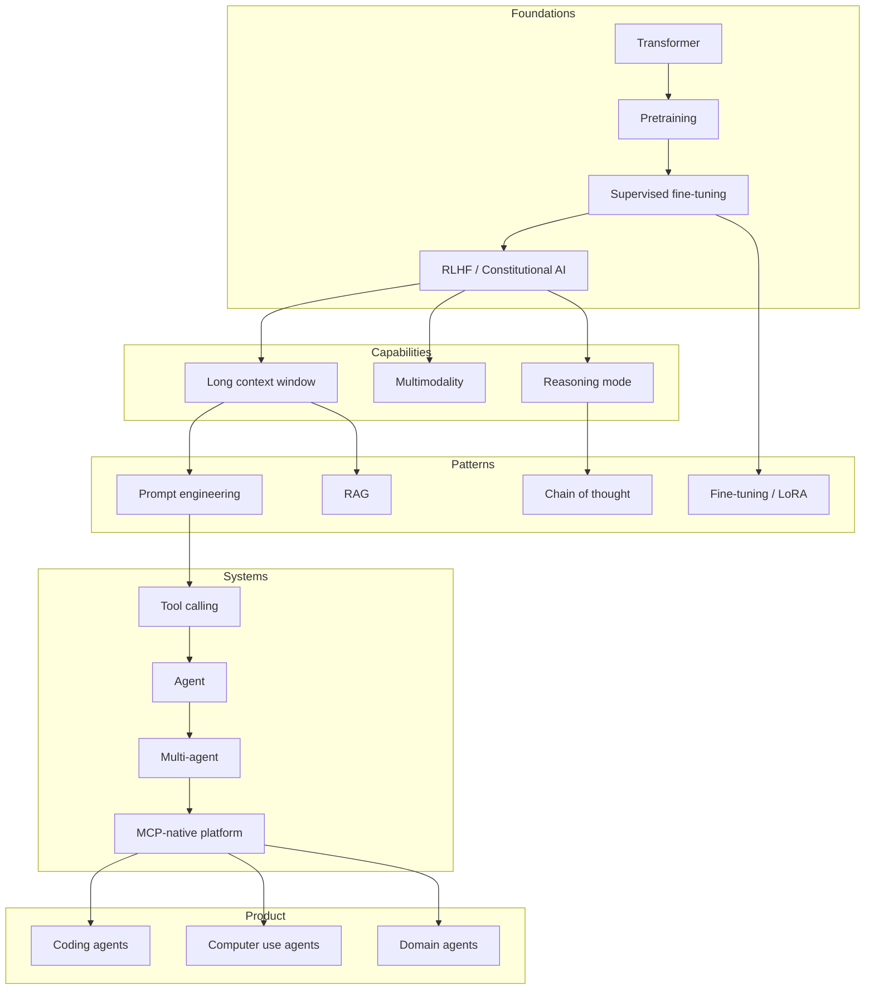

# The AI Saga

*From the first spark of ChatGPT to Claude Opus 4.7 — a backend engineer's field guide to the age of intelligent machines.*

> "The future is already here — it's just not evenly distributed." — William Gibson

📖 *Start with the [Preface](./preface.md) — a short note on why this book exists and how to read it.*

---

## A view of the journey

---

## Who this book is for

A working software engineer — maybe three to six years into a career — who is already fluent in Python or Java, lives in the web stack, and deploys to GCP or AWS. You are curious about AI, you've used ChatGPT and Copilot, and you suspect the ground is moving under your feet. You want:

1. **The story.** How did we get from "AI winter" to Claude Opus 4.7 in fifteen years?
2. **The concepts.** What is attention, what is RAG, what is an agent, what is MCP — explained without hand-waving and without heavy math.
3. **The craft.** How to use these tools to do your actual job at 10× the speed, without shipping garbage.
4. **The career.** A staged, realistic plan to stay — and become more — relevant over the next 24 months.

This is written as a book for general use: linear if you want, skippable if you don't. Every chapter is standalone enough to read on a flight.

---

## How to read this book

- **Beginners:** read Parts I–III in order, then skim Part IV, then read Part V slowly with a terminal open.
- **Experienced devs:** skim Part I, skip to Part III (Agents), and invest in Part V and VI.
- **Managers / staff+ engineers:** read Parts I, IV, and VI. Skim the rest.
- **Everyone:** keep the one-page cheat sheet in Appendix E pinned somewhere.

Each chapter ends with a **Further reading & watching** section. These links are the most important part of the book — the saga is still being written, and that's where you'll find the next month's updates.

---

## Contents

### Part I — Origins

- [Chapter 1 · The Prologue: Before ChatGPT](./ch1-prologue-before-chatgpt.md) — The quiet decade of deep learning. AlexNet, attention, Transformers, BERT vs GPT, scaling laws, GPT-3. Sets up why late-2022 felt like lightning.
- [Chapter 2 · The ChatGPT Moment](./ch2-chatgpt-moment.md) — November 30, 2022. 100M users in two months. Why *chat* was the killer interface, and what RLHF actually did.
- [Chapter 3 · Anatomy of an LLM](./ch3-anatomy-of-llm.md) — Tokens, embeddings, attention, next-token prediction, context windows, temperature. The mental model every engineer needs.

### Part II — The Scaling Era

- [Chapter 4 · GPT-4 and the Frontier Race](./ch4-gpt4-frontier-race.md) — March 2023 onward. Multimodality, the five frontier labs, and the arrival of reasoning models.
- [Chapter 5 · The Open-Source Counter-Movement](./ch5-open-source-movement.md) — LLaMA, Mistral, Qwen, DeepSeek, Hugging Face, quantization, and why you can run a 70B model on your laptop.
- [Chapter 6 · Prompt Engineering, Properly](./ch6-prompt-engineering.md) — System prompts, few-shot, chain-of-thought, structured outputs, evals. Prompting as API design.
- [Chapter 7 · RAG — Retrieval-Augmented Generation](./ch7-rag.md) — The #1 shipped pattern. Embeddings, vector DBs, chunking, hybrid search, reranking, contextual retrieval.
- [Chapter 8 · Fine-tuning, LoRA, and PEFT](./ch8-fine-tuning.md) — When to fine-tune, when not to. The modern, cheap methods.

### Part III — The Agent Era

- [Chapter 9 · From Chatbots to Agents](./ch9-chatbots-to-agents.md) — ReAct, AutoGPT, the 2023 Cambrian explosion, and what modern agents actually look like.
- [Chapter 10 · Tool Use & Function Calling](./ch10-tool-use.md) — The API primitive that turned LLMs into software. Parallel tools, error handling, safety.
- [Chapter 11 · Multi-Agent Systems](./ch11-multi-agent-systems.md) — Orchestrators, specialists, planners, critics. When more than one agent earns its keep.
- [Chapter 12 · MCP — The Model Context Protocol](./ch12-mcp.md) — The USB-C of AI. Why this matters more than any single model release.

### Part IV — The Claude Opus Line

- [Chapter 13 · From Claude 1 to Opus 4.7](./ch13-claude-opus-timeline.md) — A focused timeline of the Claude family, ending at the model you're talking to today.

### Part V — The Developer Toolkit

- [Chapter 14 · The Coding Assistant Evolution](./ch14-coding-assistants.md) — Copilot → Cursor → Claude Code → autonomous engineers. Four generations in five years.
- [Chapter 15 · The Backend Engineer's AI Toolkit](./ch15-backend-toolkit.md) — Installable stack for 2026: model APIs, local runners, vector DBs, eval frameworks, observability.
- [Chapter 16 · AI for Python, Java, Web, GCP, and AWS](./ch16-stack-specific-ai.md) — High-leverage moves for each part of your stack, with code.
- [Chapter 17 · Daily Workflow Integration](./ch17-daily-workflows.md) — How to actually reach 10× without losing craft.

### Part VI — The Road Ahead

- [Chapter 18 · A Skills Roadmap for 2026 → 2028](./ch18-skills-roadmap.md) — This month, this quarter, this year, in two years. A staged plan.
- [Chapter 19 · Projects to Build](./ch19-projects-to-build.md) — Ten concrete projects, ranked by difficulty. Do three this quarter.
- [Chapter 20 · Ethics, Safety, and the Big Questions](./ch20-ethics-safety.md) — Alignment, jailbreaks, hallucinations, jobs, regulation.
- [Chapter 21 · Epilogue: Staying Human in a Machine-Augmented Career](./ch21-epilogue.md) — What compounds when the agents do the typing.

### Front matter

- [Preface · Why this book exists](./preface.md)

### Appendices

- [Appendix A · Glossary](./appendix-a-glossary.md) — One-line definitions of every term used in the book.
- [Appendix B · Canonical Papers](./appendix-b-papers.md) — The 25 papers that built modern AI, with one-paragraph summaries.
- [Appendix C · Video Playlist](./appendix-c-videos.md) — A curated learning path from "what is a token" to "let's build GPT from scratch."
- [Appendix D · Communities, Newsletters, Feeds](./appendix-d-communities.md) — Where the field's real-time knowledge actually lives.
- [Appendix E · One-Page Cheat Sheet](./appendix-e-cheat-sheet.md) — Mental models, default stack, decision tree, daily practice.

---

## The shape of the story, at a glance

And the engineering worldview that follows from it:

Every chapter in this book lives somewhere on that arrow.

### The reader's journey

### A map of how the pieces fit

---

## Acknowledgments and disclaimers

This book distills decades of work by thousands of researchers and engineers across OpenAI, Anthropic, Google DeepMind, Meta FAIR, Mistral, the Hugging Face community, and countless universities and independent builders. It is opinionated where I think opinion helps, and quietly agnostic where it doesn't. Every claim about a specific product or model reflects the state of the world as of **April 2026**; expect anything vendor-specific to drift within weeks.

The AI Saga is versioned. Come back in a quarter and the later chapters will have moved. That's the point.

*Ship something this week.*

---

*Next: [Chapter 1 — The Prologue: Before ChatGPT →](./ch1-prologue-before-chatgpt.md)*
